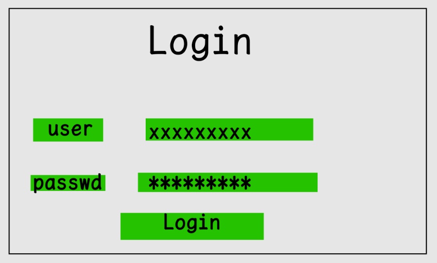

# QT Class Manager System
## Page

## DataBase
### User
| Column          | Type     | lenth | Remark      |
|-----------------|----------|-------|-------------|
| UserName        | text     |       | primary key |
| Password        | text     |       |             |
| Permission      | bool     |       |             |
### RoomStatu
| Column          | Type     | lenth | Remark      |
|-----------------|----------|-------|-------------|
| RoomNumber      | int      |       | primary key |
| Reservation     | bool     |       |             |
| ReservationDate | datetime |       |             |
| CheckIn         | bool     |       |             |
| CheckInDate     | datetime |       |             |
| CheckInTime     | datetime |       |             |
| PeopleNumber    | int      |       | NotNull     |
| Remark          | text     |       |             |
### Event
| Column          | Type     | lenth | Remark      |
|-----------------|----------|-------|-------------|
| DateTime        | datetime |       | primary key |
| RoomNumber      | int      |       | NotNull     |
| Event           | text     |       | NotNull     |
| State           | int      |       | 0=compelete |
### Room
| Column          | Type     | lenth | Remark      |
|-----------------|----------|-------|-------------|
| RoomNumber      | int      |       | primary key |
| Price           | int      |       | NotNull     |
| VIP             | int      |       | 0%-100% Sale|
### Roomer
| Column          | Type     | lenth | Remark      |
|-----------------|----------|-------|-------------|
| DateTime        | datetime |       | primary key |
| Name            | text     |       | NotNull     |
| PersonID        | text     | 18    | NotNull     |
| Phone           | text     | 11    | NotNull     |
| Gender          | bool     |       | T=♂ NotNull|
| RoomNumber      | int      |       | NotNull     |
| UseVIP          | bool     |       | defalut:F   |
| State           | int      |       | 0=exit,1=reser,2=checkin...|

## version
### 0.0.3 sql
创建SQLite，完善数据库设计

### 0.0.2 init
合并VS项目与QTC项目
设计数据库

### 0.0.1 init
初始化项目